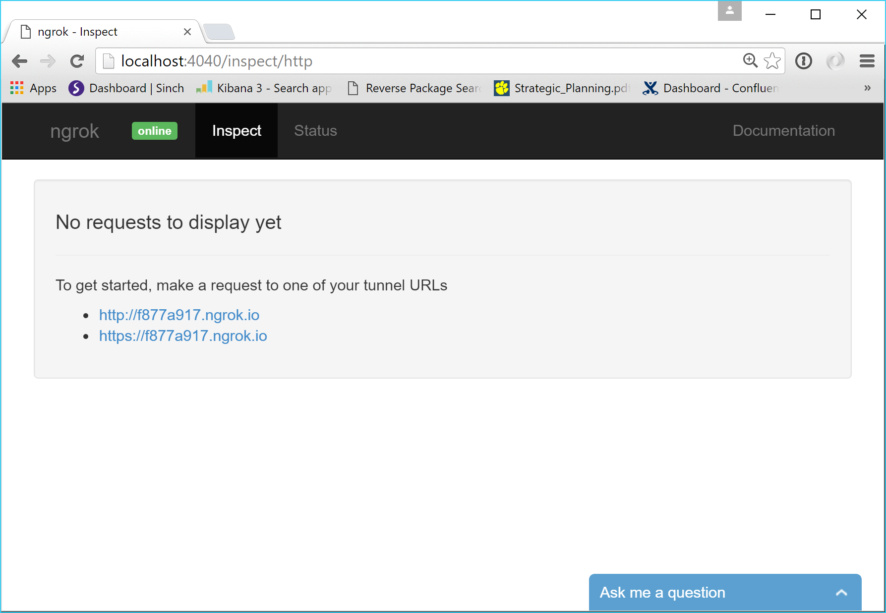
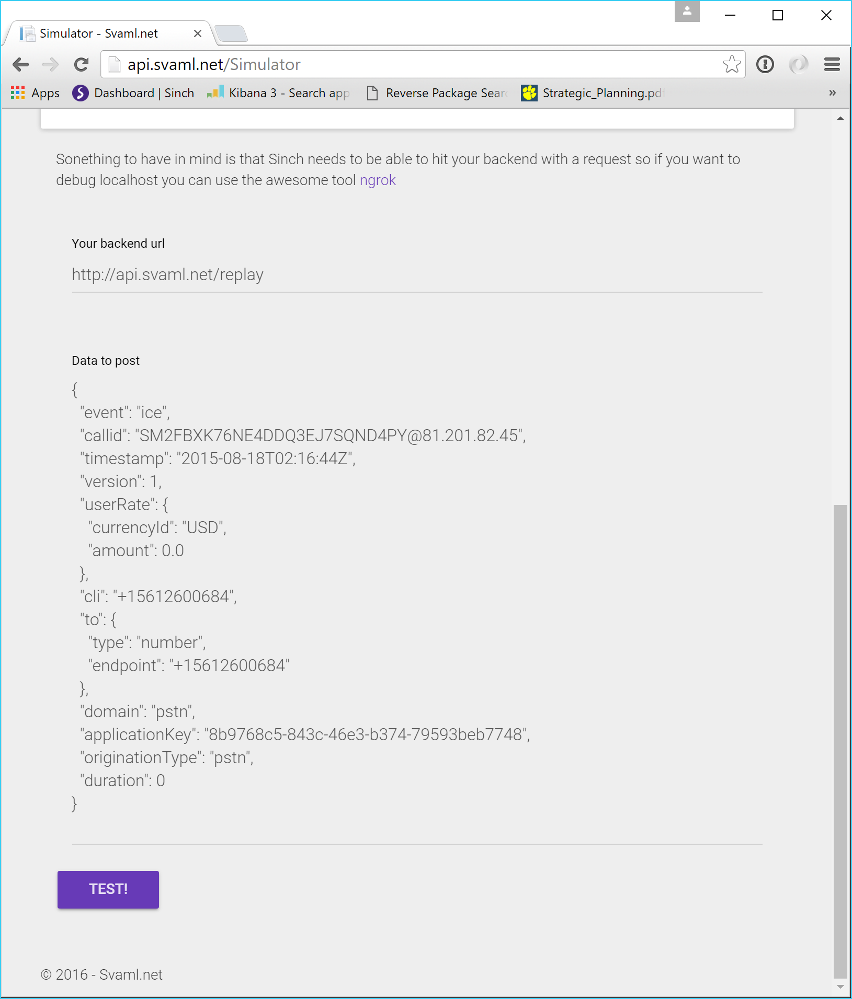
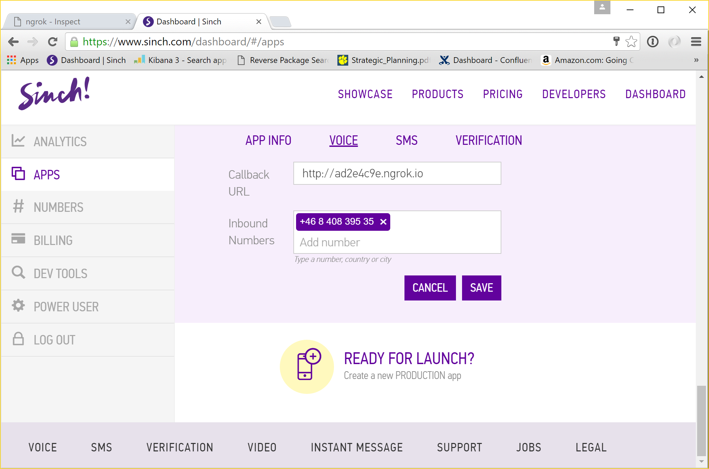

# Getting a second number and testing Sinch Callbacks/Webhooks with ngrok.

Today I will show how you can redirect a Sinch number to your own mobile number. Since a few friends (and my boss) live in Sweden, I thought it'd be cool to have a Swedish number that can be redirected to my US mobile. 

Before we dive in, I want to show you the awesome tool, ngrok. One of the more difficult aspects of an integration with webhooks/callbacks is that the remote server needs to be able to access your server. Typically, your dev server is not available as a web server on the internet, so you have to rely on dynamic DNS or a similar solution. You can easily remedy this with the use of [ngrok](https://ngrok.com/ "ngrok"). It sets up a tunnel and enables you to see all requests and responses with data. 

## Getting started
In this example we are going to build a simple node app that will respond with SVAML to connect any call to a chosen number to my SF-based mobile. To read more about different events and how you can respond, read the docs here
[http://sinch.com/docs/voice/rest](http://sinch.com/docs/voice/rest "SVAML") 

Create a file and call it app.js
```javascript
var http = require('http')

var server = http.createServer(function (request, response) {
    var data = '';
    request.on('data', function (chunk) {
        data += chunk;

    });
    request.on('end', function () {
        var requestModel;
        var responsedata;
        if (data == '') {
            response.writeHead(500, { 'Content-Type': 'application/json' });
            response.end('{"message":"no data posted"}');
            return;
        }
        requestModel = JSON.parse(data);
        response.writeHead(200, { 'Content-Type': 'application/json' });
        switch (requestModel.event) {
            case "ice":
                responsedata = {
                    instructions: [],
                    action: {
                        name: "connectpstn",
                        destination: {
                            type: "number",
                            endpoint: "+15612600684"
                        },
                        cli: "+15612600684",
                        maxDuration: 14400,
                        locale: "en-US"
                    }
                };
                break;
            case "ace":
                responsedata = {
                    "instructions": [],
                    "action": {
                        "name": "continue"
                    }
                };
                break;
            default:
                responsedata = {}
        }
        response.end(JSON.stringify(responsedata));
    }
    );
});
server.listen(5500);
```
As you can see, we just need to read the body of the request, look to see if it's an incoming call (start of call) or if someone answered, and reply with the correct action to connect the call. We start the server on port 5500.  

Before we continue, install ngrok https://ngrok.com/download. It's a one file app with no installer. Unpack it to a folder of your choice (I love ngrok so I also put in in path so I can access it easily from anywhere). 

On windows, you need two terminals, one for node and one for ngrok. Start your node app 
```bash
node app.js
```
start ngrok
```bash
ngrok http 5500
```
After starting ngrok you should see the dynamic domain name you were given. Open a browser and point it to http://localhost:4040/ and you should see this: 

Take note of the url. Before I connect up a real phone number in the Sinch portal, I want to make a sample request to the url. Head over to http://svaml.net/simulator to simulate an incoming call event.

Change the url to the ngrok url. Hit test and you should now see what was posted to the server and what the response was in your http://localhost:4040/. Everything looks good! If something's not working the way you wanted, you can use your favorite node debugger and step thru code from real integration traffic. Awesome, right? 

## Wrapping up
Let's wrap this up and add a number to Sweden as I mentioned at the start. 

To make this happen you must have an application in the Sinch dashboard and a phone number (DM me @cjsinch if you need some more test credits) 
1. Rent a number with voice capability in the [rent number](https://www.sinch.com/dashboard/#/numbers) 
2. Go to your app [https://www.sinch.com/dashboard/#/apps](https://www.sinch.com/dashboard/#/apps) or create one 
3. Configure the voice tab by adding your newly rented number and add your ngrok url


Call the number and start seeing real live requests from the Sinch plattform.

Hope you found this helpful and if you have any questions dm me on @cjsinch  
   
